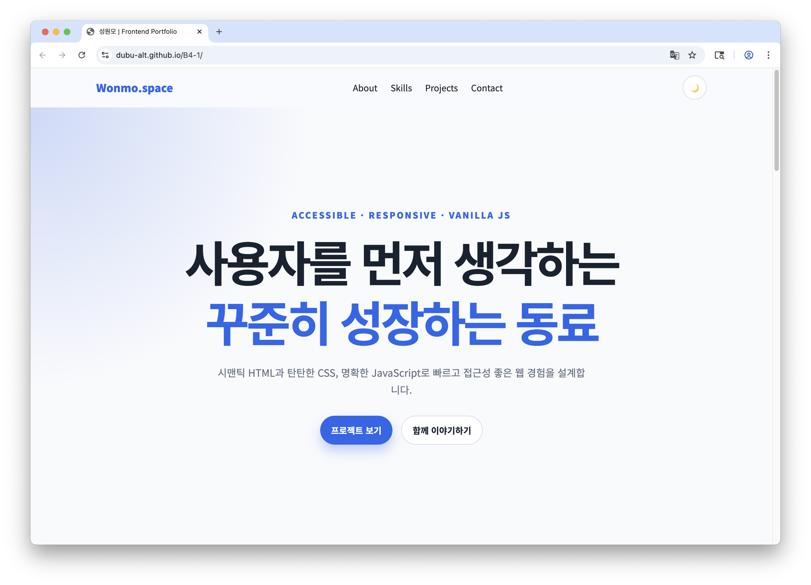
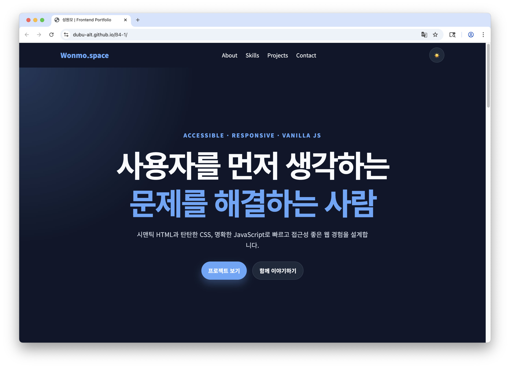
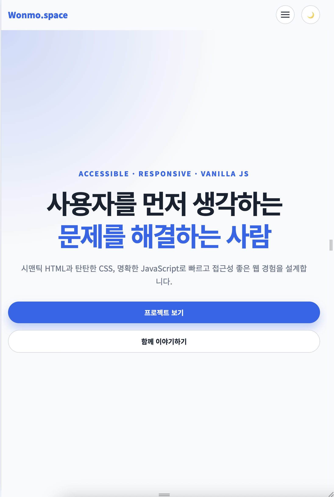
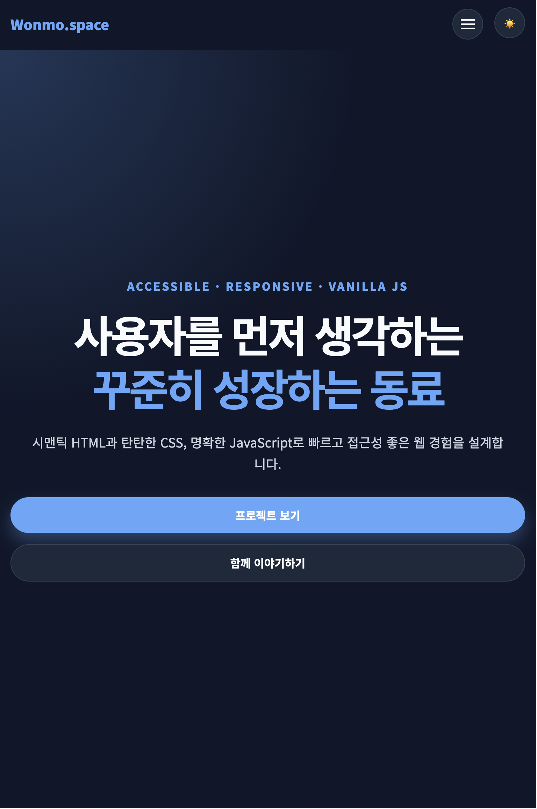
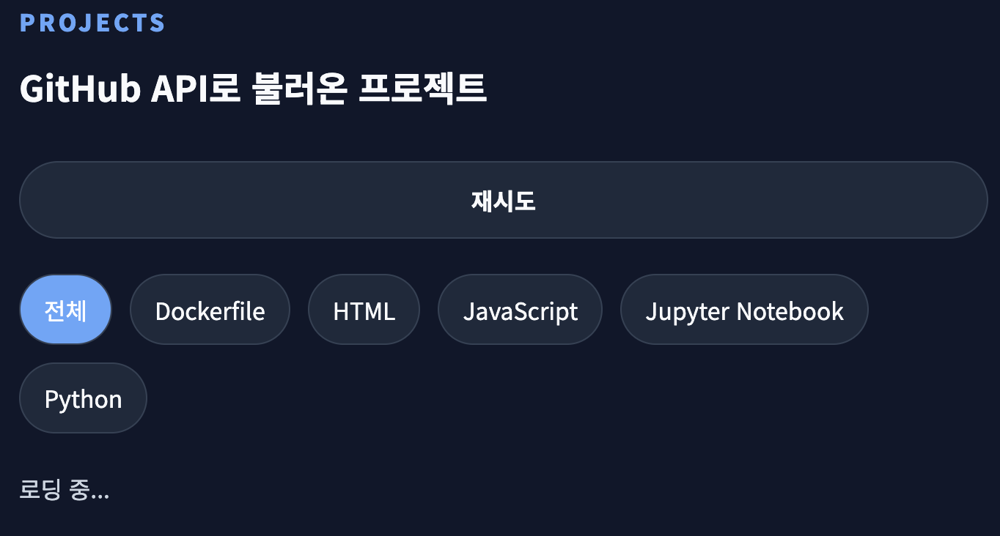
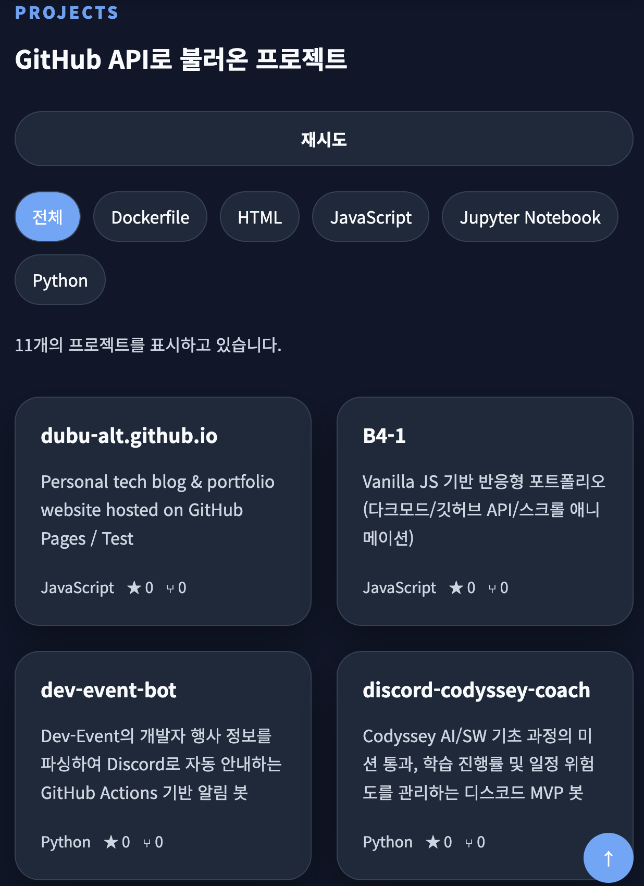
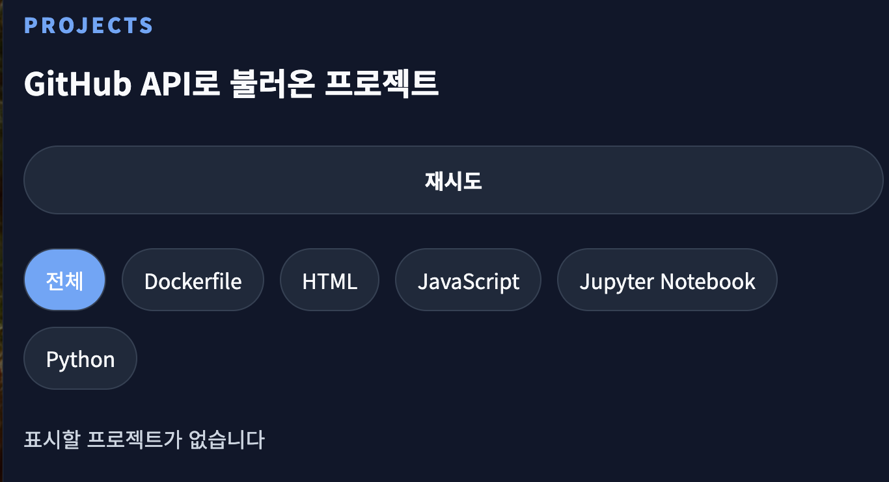
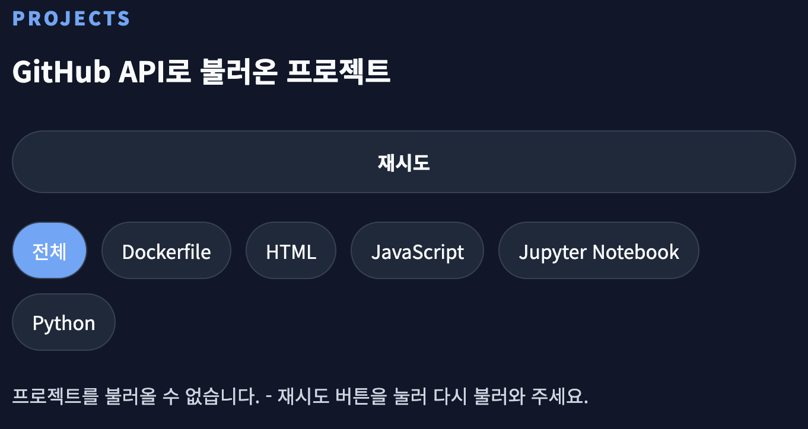

# 웹 기초 완성, 나만의 포트폴리오 구축

## 프로젝트 개요 (Project Overview)

- 순수 HTML/CSS/JavaScript만으로 구축하는 반응형 포트폴리오 웹사이트입니다.

## 실행 환경 (Environment)

- **언어**: HTML5, CSS3, ES6+ JavaScript
- **런타임**: Node.js (25.9.0)

## 프로젝트 구조 (Project Structure)

```text
.
├── index.html           # 메인 페이지
├── css/                 # 스타일시트 디렉토리
│   ├── base.css         # 기본 스타일 및 변수
│   ├── layout.css       # 전체 레이아웃 (header, footer 등)
│   ├── components.css   # 공통 컴포넌트 (버튼, 카드 등)
│   ├── sections.css     # 각 섹션별 스타일 (hero, about 등)
│   ├── utilities.css    # 유틸리티 클래스
│   ├── responsive.css   # 반응형 미디어 쿼리
│   └── style.css        # 외부 스타일시트 (import 모음)
├── js/                  # JavaScript 디렉토리
│   └── main.js          # 메인 스크립트
└── images/              # 이미지 디렉토리
```
| 파일 | 역할 |
| --- | --- |
| `index.html` | 시맨틱 태그로 구성된 메인 페이지 (Hero, About, Skills, Projects, Contact, Footer) |
| `css/style.css` | 개별 CSS 파일들을 `@import`로 불러오는 진입 파일 |
| `css/base.css` | CSS 변수(`:root`, 다크모드 변수 `[data-theme="dark"]`) 및 전역 기본 스타일 관리 |
| `css/layout.css` | 헤더·네비게이션·섹션 공통 구조·푸터 등 전체 레이아웃 관리 |
| `css/components.css` | 버튼, 카드, 필터 버튼, 메뉴 토글 등 재사용 UI 컴포넌트 스타일 관리 |
| `css/sections.css` | Hero/About/Skills/Projects/Contact 섹션별 세부 스타일 관리 |
| `css/utilities.css` | 스크롤 reveal 애니메이션, `sr-only` 등 유틸리티 클래스 관리 |
| `css/responsive.css` | 768px, 1024px 브레이크포인트 기준 반응형 스타일 관리 |
| `js/main.js` | `state` 객체 기반으로 다크모드, 메뉴 토글, 스크롤 UI, GitHub API 연동, 프로젝트 필터링/렌더링, 폼 유효성 검사, 타이핑 효과 등 전체 인터랙션을 관리하는 메인 스크립트 |

<details>
<summary><h2>수행 항목 체크리스트</h2></summary>
<div markdown="1">
  
### HTML 구조 (시맨틱 마크업)

- [x] 시맨틱 태그 사용 권장
- [x] Hero, About, Skills, Projects, Contact, Footer 섹션 구성
- [x] 네비게이션 내 각 섹션 이동 앵커 링크 구현
- [x] 모든 이미지 의미 있는 `alt` 속성 부여
- [x] 폼 요소에 `<label>` 연결 (`for`-`id` 매칭)

### CSS 스타일링 (레이아웃 & 반응형)

- [x] 외부 스타일시트(`css/style.css`) 연동
- [x] CSS 변수(`:root`) 활용 (색상, 폰트, 간격 등)
- [x] 다크 모드용 CSS 변수 분리 정의 (`[data-theme="dark"]`)
- [x] 네비게이션에 `Flexbox`, Projects 카드에 `Grid`(`auto-fit`, `minmax`) 활용
- [x] 반응형 디자인 설계 (브레이크포인트: 768px, 1024px) — ⚠️ `responsive.css`가 `max-width` 쿼리로 작성되어 실제로는 **데스크톱 퍼스트 + 모바일 오버라이드** 구조 (아래 "주요 기능 1)" 참고)
- [x] 모바일 환경 햄버거 메뉴 디자인 구성
- [x] 버튼 및 카드 요소 `hover`(`transition`) 효과 적용
- [x] 카드 `box-shadow` 효과 적용

### JavaScript 기초 및 인터랙션

- [x] JS 파일 `defer` 속성 연동
- [x] `var` 사용 금지 (`const`, `let` 사용)
- [x] 인라인 `onclick` 대신 `addEventListener` 이벤트 처리
- [x] 모바일 햄버거 메뉴 토글 구현
- [x] 네비게이션 클릭 시 부드러운 스크롤(`smooth scroll`) 구현 — ⚠️ JS가 아닌 CSS `scroll-behavior: smooth`로 구현 (아래 "주요 기능 5)" 참고)
- [x] 스크롤 300px 이상 탑 버튼 구현
- [x] 스크롤 60px 이상 네비게이션 배경색 변경
- [x] 다크 모드 전환 및 설정 값 로컬스토리지(`localStorage`) 유지
- [x] Intersection Observer 활용 스크롤 애니메이션(임계값 0.2 이상) 구현

### 폼 UX 개선

- [x] Contact 문의 폼 제출 이벤트 제어 (`event.preventDefault()`)
- [x] 필수값(이름, 이메일, 메시지) 유효성 검사 (빈 필드 제출 불가)
- [x] 이메일 형식 유효성 검사
- [x] 입력 필드 근처 에러 메시지 표시
- [x] 유효성 검사 통과 시 제출 성공 메시지 표시

### API 연동 및 상태 관리

- [x] ES6+ 문법 적용(화살표 함수, 구조분해 할당, 템플릿 리터럴, 배열 메서드)
- [x] `fetch`, `async/await` 활용 GitHub API 호출
- [x] `try/catch` 비동기 에러 처리 (API 레이트 리밋 403 에러 포함)
- [x] 데이터 상태별 UI 분기 렌더링:
  - [x] 로딩 상태 (스피너 또는 "로딩 중...")
  - [x] 성공 상태 (카드 리스트 렌더링)
  - [x] 에러 상태 ("프로젝트를 불러올 수 없습니다" + [재시도] 버튼)
  - [x] 빈 상태 ("표시할 프로젝트가 없습니다")
- [x] "사용자 이벤트 → 상태 변경 → 화면 업데이트" 기능 3가지 이상 구현 (실제로는 5가지 구현됨)

### 배포

- [x] GitHub Pages 배포
- [x] 배포 URL 내 기능 정상 동작 확인(인터랙션, API 연동, 폼 검사 등)
- [x] README.md 작성 (프로젝트 설명, 사용 기술, 배포 URL, 스크린샷)

### 보너스 과제

- [x] **프로젝트 필터링**: 언어별 필터링 버튼 구현 (`array.filter()` 활용)
- [x] **타이핑 효과**: Hero 섹션 타이핑 애니메이션 구현
- [x] **폼 실제 전송**: Formspree 또는 EmailJS 연동 실제 이메일 전송 구현
- [x] **시스템 다크 모드 감지**: `prefers-color-scheme` 활용 시스템 테마 감지 및 반영

### 제약 사항 (Constraints)

- **외부 라이브러리 사용 금지**: React, Vue, jQuery, Bootstrap, Tailwind CSS 등 사용 불가
- **허용 항목**: 아이콘(Font Awesome), 웹 폰트(Google Fonts)만 허용
- **코드 스타일**:
  - `var` 대신 `const`, `let` 사용
  - HTML에 `onclick` 대신 `addEventListener` 사용
  - 인라인 스타일(`style="..."`) 사용 금지
- **브라우저**: 최신 Chrome 브라우저에서 정상 동작
- **GitHub API 주의**: 인증 없이 호출 시 시간당 60회 제한(레이트 리밋)이 있으므로, 짧은 시간 내 반복 새로고침을 피한다

</div>
</details>

### 커스텀 설정값 명세

| 항목                         | 기준값     | 비고           |
| ---------------------------- | ---------- | -------------- |
| 스크롤 탑 버튼 표시          | 300px 이상 | 자유 변경 가능 |
| 네비게이션 배경색 변경       | 60px 이상  | 자유 변경 가능 |
| Intersection Observer 임계값 | 0.2 이상   | 자유 변경 가능 |


## 결과물 (Deliverables)
- 배포 URL: [GitHub Pages](https://dubu-alt.github.io/B4-1/)
<details>
<summary><h2>스크린샷:</h2></summary>
<div markdown="2">
  
#### 1) 반응형 & 다크모드
 
| 데스크톱 (라이트) | 데스크톱 (다크) |
| :---: | :---: |
|  |  |
 
| 모바일 (라이트) | 모바일 (다크) |
| :---: | :---: |
|  |  |

---
#### 2) GitHub API 연동 — 상태별 UI
 
| 로딩 상태 | 성공 상태 |
| :---: | :---: |
|  |  |
 
| 빈 상태 | 에러 상태 |
| :---: | :---: |
|  |  |

</div>
</details>

## 프로젝트 소개
이 웹 포트폴리오는 다음 6개 섹션으로 구성하였습니다.

- **Hero**: 인사말 문구, 타이핑 애니메이션, CTA 버튼 2종
- **About**: 자기소개 텍스트, 프로필 일러스트
- **Skills**: 기술 스택 카드 목록
- **Projects**: GitHub API로 불러온 저장소 카드, 언어별 필터
- **Contact**: 이름/이메일/메시지 문의 폼
- **Footer**: 저작권 문구, 맨 위로 이동 링크

`<div>`로만 화면을 나누지 않고, 각 영역의 역할이 태그 자체로 드러나도록 시맨틱 태그를 사용했습니다.

| 태그 | 용도 |
| --- | --- |
| `<header>` | 사이트 상단 고정 헤더 (`data-header`) |
| `<nav>` | 주요 메뉴, `aria-label="주요 메뉴"`로 스크린 리더에 역할 안내 |
| `<main>` | 페이지의 핵심 콘텐츠 영역 |
| `<section>` | Hero/About/Skills/Projects/Contact 각 영역, `id`로 앵커 이동 대상 지정 |
| `<figure>` / `<figcaption>` | About의 프로필 이미지와 설명을 하나의 의미 단위로 묶음 |
| `<article>` | Skills 카드, Projects 카드처럼 독립적으로 반복되는 콘텐츠 단위 |
| `<footer>` | 저작권 및 맨 위로 이동 링크 |

폼 요소는 `<label for="...">`와 입력의 `id`를 일치시켜 연결했고, 에러 메시지 영역은 `aria-describedby`로 입력 필드와 연결되도록 JS(`setFieldError`)에서 처리합니다. `data-*` 속성(`data-menu-toggle`, `data-theme-toggle`, `data-contact-form` 등)을 CSS 클래스와 분리된 JS 훅으로 사용해, "스타일용 클래스"와 "동작용 선택자"의 역할을 나눴습니다.

<details>
<summary><h2>주요 기능</h2></summary>
<div markdown="3">

### 1) 반응형 레이아웃

`responsive.css`는 `@media (max-width: 768px)`, `@media (max-width: 1024px)` 형태의 **max-width 쿼리**로 작성되어 있습니다. 이는 큰 화면 스타일을 기본값으로 두고 화면이 좁아질 때 규칙을 덮어쓰는 방식이라, 실제로는 **데스크톱 퍼스트 + 모바일 오버라이드** 구조입니다. README 체크리스트에는 "모바일 퍼스트"라고 적혀 있지만, 코드만 보면 반대 방향으로 짜여 있다는 점은 알아두는 게 좋습니다. (자기소개서나 코드 리뷰에서 "모바일 퍼스트"라고 말하면 코드와 어긋나므로, 방식을 바꾸거나 설명을 맞추는 것을 추천합니다.)

### 2) 햄버거 메뉴

`.menu-toggle` 버튼 클릭 시 `setMenuState(!state.isMenuOpen)`이 호출되어 `state.isMenuOpen` 값이 토글되고, 그 값에 따라 `.nav-links`에 `is-open` 클래스가 붙거나 빠집니다. 동시에 `aria-expanded`, `aria-label`도 열림/닫힘 상태에 맞게 갱신됩니다. 메뉴 안의 링크를 클릭하면 이벤트 위임(`selectors.menu.addEventListener('click', ...)`)으로 감지해 메뉴를 자동으로 닫습니다.

### 3) 다크 모드

`getInitialTheme()`이 `localStorage`에 저장된 값을 먼저 확인하고, 없으면 `prefers-color-scheme: dark` 미디어쿼리로 시스템 설정을 읽어옵니다. 선택된 테마는 `document.documentElement.dataset.theme`에 반영되며, `base.css`의 `[data-theme="dark"]` 선택자가 같은 이름의 CSS 변수를 다른 값으로 덮어써서 색상 전체가 한 번에 바뀝니다. 토글 시마다 `localStorage.setItem('theme', ...)`으로 값을 저장해 새로고침 후에도 유지됩니다.

### 4) 스크롤 탑 버튼 / 헤더 스타일 변경

스크롤 이벤트 하나(`updateScrollUi`)에서 두 가지를 동시에 처리합니다.

```js
selectors.header.classList.toggle('is-scrolled', scrollY >= 60);
selectors.topButton.classList.toggle('is-visible', scrollY >= 300);
```

60px 이상 스크롤되면 헤더에 배경/그림자가 생기고, 300px 이상이면 맨 위로 이동 버튼이 나타납니다. 버튼 클릭 시 `window.scrollTo({ top: 0, behavior: 'smooth' })`로 최상단 이동을 처리합니다.

### 5) 부드러운 스크롤

이 프로젝트는 부드러운 스크롤을 JS의 `scrollIntoView()`가 아니라 **CSS 한 줄**로 처리합니다.

```css
html {
  scroll-behavior: smooth;
}
```

메뉴 링크가 `href="#about"` 같은 앵커이기만 하면 브라우저가 자동으로 부드럽게 스크롤합니다. 결과는 JS 구현과 동일하지만, 체크리스트에 "JS로 구현"이 명시돼 있다면 방식이 다르다는 점을 밝혀두는 게 좋습니다.

### 6) 스크롤 애니메이션

`setupRevealAnimation()`에서 `IntersectionObserver`를 `threshold: 0.2`로 생성하고, `.reveal` 클래스가 붙은 요소들을 관찰합니다. 요소가 뷰포트에 20% 이상 들어오면 `is-visible` 클래스를 추가하고, 그 즉시 `observer.unobserve()`로 관찰을 중단해 같은 요소에서 애니메이션이 반복 실행되지 않도록 합니다.

### 7) Contact 폼 유효성 검사

`handleFormSubmit`은 `event.preventDefault()`로 기본 제출을 막은 뒤 `validateContactForm()`을 실행합니다. 이름/메시지는 빈 값 여부를, 이메일은 정규식(`/^[^\s@]+@[^\s@]+\.[^\s@]+$/`)으로 형식을 검사하고, 실패한 필드마다 `setFieldError`로 에러 메시지를 표시합니다. 현재는 **제출 시점에만** 검사가 실행되며, 입력 중 실시간 검사는 구현되어 있지 않습니다. 또한 현재 코드는 검증 통과 시 폼을 초기화하고 성공 메시지만 보여줄 뿐, 실제 이메일 전송(Formspree 등)으로 이어지는 `fetch` 호출은 아직 포함되어 있지 않습니다. 보너스 항목의 "폼 실제 전송"을 체크하려면 이 부분을 추가로 연결해야 합니다.

### 8) GitHub API 연동 및 상태 관리

`fetchProjects()`는 `state.projects`라는 단일 상태를 기준으로 로딩 → 성공/에러/빈 상태를 순서대로 반영합니다.

| 상태 | 처리 |
| --- | --- |
| 로딩 | 요청 직전 `renderStatus('로딩 중...')` 호출, 리스트 비움 |
| 성공 | 저장소 배열을 `state.projects`에 저장 후 `renderProjects()`로 카드 렌더링 |
| 빈 데이터 | `state.filteredProjects.length === 0`이면 `'표시할 프로젝트가 없습니다'` 출력 |
| 에러 | `try/catch`로 잡아 `error.message` 기반 메시지 + 재시도 버튼 안내 표시, `403`은 별도 메시지로 분기 |

포크한 저장소(`fork: true`)는 `filter()`로 제외하고, 화면에 필요한 필드만 `map()`으로 추려서 저장합니다. `data-github-username` 속성 값(`octocat`)은 예시용 플레이스홀더이므로 배포 전 본인 GitHub 아이디로 교체가 필요합니다.

### 9) 프로젝트 언어 필터링

`renderFilters()`가 `state.projects`에서 언어 값을 `Set`으로 중복 제거해 필터 버튼을 동적으로 생성합니다. 필터 버튼 클릭은 `.filter-group`에 이벤트 위임으로 감지되며, `applyProjectFilter(filter)`가 `state.currentFilter`를 갱신하고 `filter()`로 조건에 맞는 프로젝트만 다시 렌더링합니다.

### 10) Hero 타이핑 효과

`typeHeroText()`는 문구 배열(`phrases`)을 한 글자씩 추가/삭제하며 순환합니다. 타이핑 속도(110ms), 삭제 속도(55ms), 문구 완성 후 대기(1300ms), 삭제 완료 후 다음 문구 전환 대기(250ms)를 각각 다른 `setTimeout` 지연으로 구분해, 사람이 타이핑하는 듯한 리듬을 흉내 냅니다.
</div>
</details>

<details>
<summary><h2>CSS 설계</h2></summary>
<div markdown="4">
CSS는 역할 단위로 6개 파일(`base`, `layout`, `components`, `sections`, `utilities`, `responsive`)로 나누고, `style.css`에서 `@import`로 한데 모읍니다.

### 1) CSS 변수

`base.css`의 `:root`에 색상, 폰트, 여백, radius, 그림자, transition 값을 변수로 정의했습니다. 다크 모드는 별도 색상 체계를 만드는 대신, `[data-theme="dark"]` 선택자 안에서 **같은 변수 이름**에 다른 값을 다시 할당하는 방식입니다. 그 결과 버튼, 카드, 폼 등 나머지 CSS는 다크 모드를 전혀 몰라도 되고, 변수 값만 바뀌면 화면 전체 색상이 자동으로 따라갑니다.

### 2) Flexbox를 사용한 곳

| 영역 | 이유 |
| --- | --- |
| `.navbar` | 로고 – 메뉴 – 버튼을 한 줄에서 좌우로 배치 (`justify-content: space-between`) |
| `.nav-links` | 메뉴 항목들을 가로로 나란히 정렬 |
| `.hero__actions` | 버튼 2개를 가운데 정렬하고 줄바꿈 허용 (`flex-wrap`) |
| `.project-card__meta` | 언어/스타/포크 정보를 한 줄로 나열, `margin-top: auto`로 카드 하단에 고정 |
| `.filter-group` | 필터 버튼들을 가로로 나열하고 줄바꿈 허용 |
| `.footer-content` | 저작권 문구와 링크를 좌우로 배치 |

한 방향(가로 또는 세로) 정렬만 필요한 곳에는 전부 Flexbox를 썼습니다.

### 3) Grid를 사용한 곳

| 영역 | 이유 |
| --- | --- |
| `.section-grid` (About, Contact) | 텍스트 영역과 이미지/폼 영역을 좌우 두 칸으로 명확히 나눔 |
| `.skills-grid` | 기술 카드들을 `repeat(auto-fit, minmax(240px, 1fr))`로 배치해, 화면 너비에 따라 열 개수가 자동 조정 |
| `.projects-grid` | GitHub API 응답 개수가 가변적이므로, 카드 개수와 무관하게 자동으로 줄바꿈되는 `auto-fit` 그리드가 적합 |

여러 개의 카드를 반응형으로 나열하거나, 화면을 큰 두 영역으로 나눠야 하는 곳은 Grid를 선택했습니다.

### 4) 그 외 설계 포인트

- `color-mix(in srgb, var(--color-primary) 22%, transparent)`처럼 CSS 변수와 `color-mix()`를 조합해, 다크/라이트 모드 전환 시 그림자·배경 그라데이션 색도 자동으로 따라가도록 처리했습니다.
- 버튼, 카드류에 `transition`을 공통으로 걸어 hover 시 `translateY`, 그림자 변화가 부드럽게 나타나도록 했습니다.
- `.reveal` / `.reveal.is-visible`은 `utilities.css`에 두어, 특정 섹션에 종속되지 않고 어떤 요소에도 재사용할 수 있게 했습니다.
</div>
</details>

<details>
<summary><h2>JavaScript 설계</h2></summary>
<div markdown="5">
  
### 1) `addEventListener`만 사용

HTML에는 `onclick` 같은 인라인 이벤트 속성이 없고, 모든 이벤트는 `main.js`의 `bindEvents()` 함수 안에서 `addEventListener`로 연결됩니다. `onclick`은 같은 이벤트에 하나만 등록할 수 있어 이후 코드가 덮어쓸 위험이 있는 반면, `addEventListener`는 같은 요소·같은 이벤트에 여러 핸들러를 안전하게 추가할 수 있고, HTML(구조)과 JS(동작)를 분리해 유지보수하기 쉽습니다.

### 2) 상태(state) 중심 구조

`main.js`는 파일을 여러 개로 쪼개지 않고 하나의 파일 안에서 `state` 객체와 `selectors` 객체를 최상단에 둔 뒤, 나머지 함수들이 이 두 객체를 참조하는 구조입니다.

```js
const state = {
  projects: [],
  filteredProjects: [],
  currentFilter: 'all',
  isMenuOpen: false,
};
```

버튼 클릭 같은 사용자 이벤트는 항상 "① 상태를 바꾼다 → ② 상태를 기준으로 화면을 다시 그린다"의 흐름을 따릅니다. 예를 들어 필터 버튼을 클릭하면 `state.currentFilter`를 바꾸고, 그 값을 기준으로 `state.filteredProjects`를 다시 계산한 뒤 `renderProjects()`가 DOM을 새로 그립니다. 이 프로젝트에서 이 흐름이 적용된 대표적인 예시 3가지는 다음과 같습니다.

1. 햄버거 버튼 클릭 → `state.isMenuOpen` 변경 → `.nav-links`에 `is-open` 클래스 반영
2. 필터 버튼 클릭 → `state.currentFilter` / `state.filteredProjects` 변경 → 프로젝트 카드 목록 재렌더링
3. 다크 모드 버튼 클릭 → `localStorage` 값 변경 → `data-theme` 속성 및 토글 아이콘 갱신

### 3) GitHub API 상태를 하나의 진실 공급원으로

로딩·에러·빈 데이터·성공, 이 네 가지 화면은 모두 `state.projects` / `state.filteredProjects` 두 값과 `renderStatus()`가 만드는 문구 하나로 결정됩니다. 별도의 `isLoading`, `hasError` 같은 boolean 플래그를 여러 개 두지 않고, "지금 프로젝트 배열에 무엇이 들어있는가"만으로 화면을 판단하기 때문에 상태가 서로 어긋날 여지가 줄어듭니다. 이런 방식을 **단일 진실 공급원(single source of truth)** 이라고 부릅니다.

### 4) 비동기 에러 처리

`fetchProjects()`는 `async/await` + `try/catch`로 작성되어 있으며, GitHub API의 요청 제한(403)을 먼저 별도로 분기해 안내 메시지를 다르게 보여주고, 그 외 실패는 공통 에러 메시지로 처리합니다. `catch` 블록에서 `state.projects`, `state.filteredProjects`를 모두 비워, 이전 요청의 데이터가 화면에 남아있지 않도록 정리합니다.
</div>
</details>
